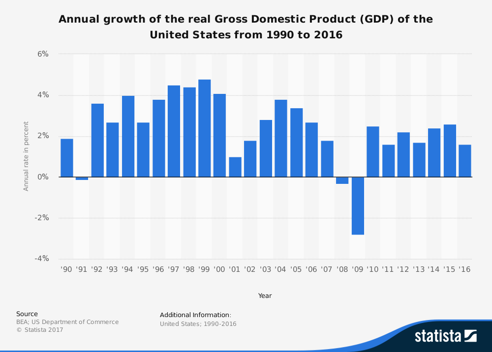

# Spring 2018
# Project 1: What did the presidents say at their inauguation?


### [Project Description](doc/)
This is the first and only *individual* (as opposed to *team*) this semester. 

Term: Spring 2018

+ Projec title: The sentiment in the inauguration speech and the GDP growth rate 
+ This project is conducted by Yiran Jiang

+ Project summary: In this project, I conducted a Sentiment Analysis on each year's inauguration speech of the president, and formed a relation between the sentiment and the previous year's GDP growth rate using a Neural Network model. Although the relation is hard to interprete in detail due to the ambiguity of the Neural Network model, it is shown that there's somewhat a relation between the sentiment in the inauguration speech and the GDP growth rate.




Following [suggestions](http://nicercode.github.io/blog/2013-04-05-projects/) by [RICH FITZJOHN](http://nicercode.github.io/about/#Team) (@richfitz). This folder is orgarnized as follows.

```
proj/
├── lib/
├── data/
├── doc/
├── figs/
└── output/
```

Please see each subfolder for a README file.
